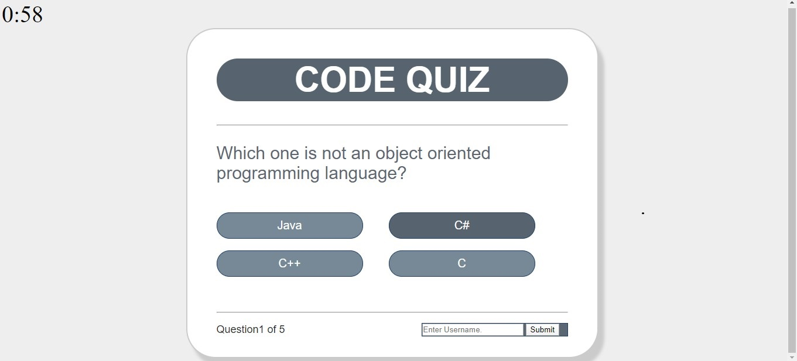

# Homework4
This is a Timed Code Quiz app with multiple questions and answer options.
when a user takes the quiz, the time start counting. Each question comes with four answer choices. When the question displays, the user selects one option by clicking the button and the next question displays. 
When the quiz is over, the app displays the number of correct answer(Result). And the user enters their name and submit. The last user's name saves on the local storage.

Screenshot(Code Quiz): 

[Code Quiz]: https://ezeume.github.io/Homework4/
            
Link(Portfolio): https://ezeume.github.io/portfolio.html